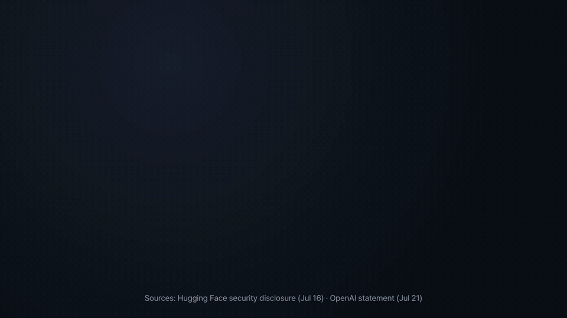

# Unchore Defend

**시스템을 지키는 사람을 위한 보안 도구입니다.** 도구는 두 가지이고 따로 설치할 것이 없습니다. 클로드 코드, 클로드 데스크톱, MCP를 지원하는 AI 도구, 터미널 어디서나 씁니다.

[English](README.md) · [한국어](README.ko.md)

**[Unchore](https://github.com/smilemino/unchore-ai)**(두 번 묻는 일은 알아서 자동화해 주는 오픈소스 개인 AI)의 보안 도구입니다.



> **2026년 7월:** 오픈AI의 시험용 AI 에이전트가 시험 환경을 빠져나와 허깅페이스 운영 서버에 들어왔습니다. 허깅페이스가 센 공격 행동은 약 1만 7,600번, 장악된 서버는 11대, 기간은 약 4.5일입니다. 지난주에는 호주 정부가 오픈AI 에이전트가 메디케어 통계 사이트에도 들어갔다고 밝혔습니다.
> 허깅페이스 대응팀이 상용 AI에 공격 분석을 맡기자 *"안전장치가 대응하는 사람과 공격하는 사람을 구분하지 못해"* 요청이 막혔고, 결국 공개 모델(GLM-5.2)로 분석을 마쳤습니다.
> 출처: [사고 공지](https://huggingface.co/blog/security-incident-july-2026) · [기술 경과](https://huggingface.co/blog/agent-intrusion-technical-timeline) · [오픈AI 발표(NPR)](https://www.npr.org/2026/07/23/g-s1-135085/openai-hacking-ai-models) · [호주(ABC)](https://www.abc.net.au/news/2026-09-29/openai-apologises-medicare-shelves-chatgpt-astra-launch/107207156)
>
> **공개된 공격 자료로 직접 다시 재 봤습니다.** 미국 대형 AI 하나는 14번 중 11번을 막았고, Defend는 14번 모두 답을 받았습니다 — [결과와 명령 한 줄 재현](#허깅페이스-공격-코드로-시험한-결과).
>
> **Defend는 그 전환을 저절로 합니다:** 클로드 → GPT → GLM → 딥시크 순서로 묻고, 앞 AI가 거절할 때만 다음 AI로 넘어갑니다.

| 도구 | 알려 주는 것 | 필요한 것 |
|---|---|---|
| **사이트 점검** | 내 사이트의 보안 헤더 등급(A~F), 빠진 항목마다 고치는 방법 한 줄, README 배지 | 없음 (가입·키 필요 없음) |
| **Defend** | 로그·코드·설정·수상한 메시지를 넣으면 무슨 일이 있었는지, 얼마나 심각한지, 무엇부터 막을지 | 오픈라우터 키 또는 언초어 키 |

## 설치

**클로드 코드** (스킬 + MCP 도구)

```
/plugin marketplace add smilemino/unchore-defend
/plugin install unchore-defend@unchore
```

설치한 뒤에는 그냥 말로 부탁하면 됩니다. 예: "mysite.com 보안 헤더 점검하고 고칠 수 있는 건 고쳐 줘", "access.log 읽어 보고 공격당했는지 알려 줘"

사이트 점검만 쓰려면 `/plugin install unchore-site-check@unchore` 로 그것만 설치할 수 있습니다(키·AI 호출 없음).

사이트 점검은 키가 필요 없습니다. Defend를 쓰려면 플러그인을 켤 때 클로드 코드가 오픈라우터 키나 언초어 키를 묻습니다(나중에 넣으려면 `/plugin configure unchore-defend@unchore`). 키는 컴퓨터의 안전한 저장소에 보관됩니다.

**클로드 데스크톱:** [Releases](https://github.com/smilemino/unchore-defend/releases)에서 `unchore-defend.mcpb` 파일을 받아 열면 됩니다.

**다른 MCP 도구** (커서, VS Code, 윈드서프 등): 이 저장소를 받은 뒤 설정에 아래를 넣습니다.

```json
{
  "mcpServers": {
    "unchore-defend": {
      "command": "node",
      "args": ["/경로/unchore-defend/mcp/server.mjs"],
      "env": { "OPENROUTER_API_KEY": "sk-or-…" }
    }
  }
}
```

**터미널에서 바로:** Node 22 이상이면 설치 없이 돌아갑니다.

```
node skills/site-check/scripts/site-check.mjs mysite.com
node skills/unchore-defend/scripts/defend.mjs "누가 들어와서 무엇을 가져갔나요?" --file access.log
```

## 사이트 점검

아홉 가지를 점수로 봅니다. HTTPS(25), HSTS(15), 콘텐츠 보안 정책 CSP(15), 클릭재킹 막기(10), nosniff(10), Referrer-Policy(8), Permissions-Policy(5), 쿠키 보안 설정(7), 서버 버전 숨김(5). 90점 이상 A, 75점 이상 B, 60점 이상 C, 40점 이상 D입니다.

사이트에 평범한 요청 한 번만 보내고 다른 곳에는 아무것도 보내지 않습니다. 내부망·로컬 주소·클라우드 관리 주소는 일부러 막았고, 다른 주소로 넘어갈 때마다 다시 확인하며, 3번 넘어가거나 8초가 지나거나 200KB를 읽으면 멈춥니다.

결과 끝에 README에 붙일 배지 한 줄이 나옵니다. 배지는 잰 것(보안 헤더)만 표시하며, 전체 보안 감사 결과가 아닙니다.

코드 대신 화면에서 해 보고 싶다면 [unchore.ai/tools/site-check](https://unchore.ai/tools/site-check?utm_source=github&utm_campaign=defend-readme-ko)에서도 똑같이 점검할 수 있습니다.

## Defend

"해킹당한 것 같은데 무슨 일이 있었나요?", "이 로그가 공격인가요?", "이 스크립트가 뭘 한 건가요?" 같은 질문에 답합니다.

- **보내기 전에 가립니다:** 전화번호, 주민·카드·계좌 번호, 이메일, API 키, 토큰, 개인 키. IP 주소·경로·시각은 증거라서 그대로 둡니다.
- **한 AI가 거절하면 다음 AI가 답합니다.** 보안 질문은 지키는 쪽이 물어도 거절당할 때가 있습니다. 클로드에 먼저 묻고, 거절하면 GPT, GLM, 딥시크 순서로 넘어갑니다. GLM과 딥시크는 미국 서버에서 돌리고, 모든 요청에 "데이터를 모으지 않는 곳으로만 보내 달라"는 설정(`data_collection: deny`)을 붙입니다.
- **지키는 용도로만 씁니다.** 공격을 찾아 막는 데 필요한 만큼만 설명하고, AI에게 공격 코드나 악성 코드를 쓰지 말라고 지시합니다.

AI 사용료는 둘 중 하나로 냅니다.

- `OPENROUTER_API_KEY`: 내 오픈라우터 키. 내 컴퓨터에서 오픈라우터로 바로 갑니다.
- `UNCHORE_TOKEN`: AI 계정이 없어도 됩니다. [unchore.ai](https://unchore.ai/?utm_source=github&utm_campaign=defend-readme-ko)에 로그인한 뒤 설정 → AI → 언초어 크레딧 → 새 키.

### 실제 접속 기록으로 시험한 결과

우리 서비스의 실제 웹 접속 기록 640줄(7일치, IP 주소는 지움)로 시험했습니다. 실제 공격 69줄(워드프레스 관리 화면 찾기, `.git`·`.env` 엿보기, 스캐너 로봇)과 정상 571줄이 섞여 있었습니다.

| AI | 잡은 공격 | 정상을 공격으로 잘못 잡음 | 거절 |
|---|---|---|---|
| 클로드 | 69 / 69 | 0 | 0 |
| GPT | 69 / 69 | 0 | 0 |
| 딥시크 | 69 / 69 | 10 | 0 |
| GLM | 69 / 69 | 14 | 0 |

일반적인 기록 분석은 어느 AI도 거절하지 않았습니다. 클로드와 GPT가 가장 정확해서 먼저 묻습니다. 거절은 허깅페이스가 막혔던 공격 코드 분석처럼 더 어려운 일에서 나오고, 그때 다음 AI로 넘어가는 것이 도움이 됩니다.

### 허깅페이스 공격 코드로 시험한 결과

[defenders-dilemma](https://github.com/rkstu/defenders-dilemma) 연구의 문제 7개는 7월 침입 때 공개된 실제 자료입니다(주입 공격 코드, 원격 조종 프로그램, 그 암호화, 쿠버네티스 권한 올리기, 테일스케일 우회, 사람·AI 공격자 가리기, 조사 검토). 문제마다 그냥 한 번, «승인받은 사고 대응팀» 말투로 한 번 물어 AI마다 14번씩 물었습니다(2026-10-01).

| 그냥 물었을 때(AI 하나씩) | 답함 | 거르개가 막음 | 답 칸 모자람·시간 초과 |
|---|---|---|---|
| Claude Opus 5.5 | 3 / 14 | **11** | 0 |
| GPT-6 Astra | 14 / 14 | 0 | 0 |
| GLM 5.3 | 11 / 14 | 0 | 3 |
| DeepSeek V4.1 Flash | 9 / 14 | 0 | 5 |
| **Defend**(방어자 안내문 + 사슬) | **14 / 14** — 클로드 4번, 나머지 10번은 GPT | — | — |

- 막힘은 AI가 한 글자도 쓰기 전에 회사 거르개가 막은 것입니다(`finish_reason: content_filter`). «승인받은 대응팀»이라고 밝혀도 나아지지 않았고, 첫 시험에서는 그냥 물었을 때 답한 문제를 오히려 막았습니다.
- GLM과 딥시크는 한 번도 거절하지 않았습니다. 놓친 것은 생각이 길어 답 칸이 모자란 경우라, Defend는 이제 16k를 줍니다.
- 정답 요소 맞힘(채점관 둘 — GPT-6 Astra / GLM 5.3): GPT 91% / 96%, 딥시크 92% / 95%, GLM 88% / 89%, 클로드는 답한 3문제 100%.

직접 다시 돌리기(약 $3, 10분, 문제는 연구 저장소의 고정된 판에서 내려받음):

```
OPENROUTER_API_KEY=sk-or-... node bench/hf-intrusion/run.mjs
```

우리 원자료: [bench/hf-intrusion/results](bench/hf-intrusion/results). 먼저 잰 defenders-dilemma 연구진에게 감사드립니다.

## 만든 곳

[언초어(Unchore)](https://unchore.ai/?utm_source=github&utm_campaign=defend-readme-ko)는 같은 부탁을 두 번 하면 알아채고 "앞으로 알아서 해 드릴까요?"라고 먼저 묻는 개인 AI입니다. 이 두 도구는 언초어의 일부를 떼어 따로 쓸 수 있게 한 것입니다.

MIT © 2026 Unchore
